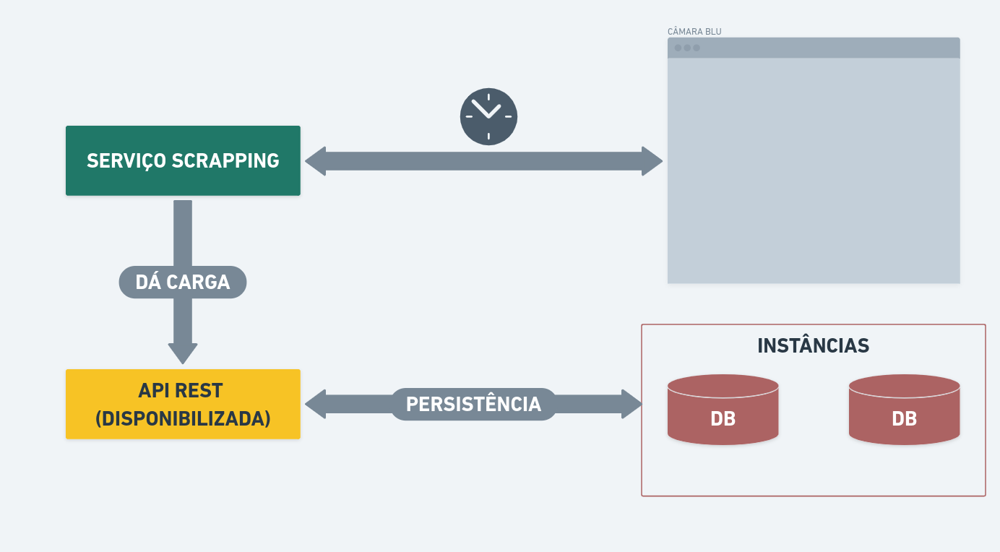

.png)
# Menslegis Dashboard Interface

The first Menslegis user interface was developed in Next.js, a React framework under the Typescript super set:

- Displaying data via graphs and tables (with a data caching strategy)
- Customization of the dashboard state with the possibility of saving the dashboard state in the client (localStorage)
- Listing and filtering propositions based on filter data provided by the RESTful API
- Basic interface features: customizable theme, dark mode, Redux for global state control

###

A primeira interface de usuário do Menslegis foi desenvolvida em Next.js um framework React sob o super set do Typescript, suas funcionalidades principais concentram-se na:

- Exibição de dados via gráficos e tabelas (c/ estratégia de cache desses dados)
- Customização do estado do dashboard com possibilidade de salvamento do estado do dashboard no client (localStorage)
- Listagem e filtragem de proposições baseado nos dados de filtros fornecidos pela API RESTful
- Recursos básicos de interface: tema personalizável, dark mode, Redux para controle de estado global

## System Overview

Menslegis is an application that is still in its MVP stage and therefore has limited functionality. However, its API has been developed based on project standards that allow for safe and rapid scalability, making the application's main purpose clear from the outset.

This means that the aim is to achieve a mature application for digital democratic interaction, capturing the preferences and reactions of voters about the parliamentarians in office in terms of their productivity and the quality of the content of their legislative proposals.

###

O Menslegis é uma aplicação que ainda está no seu estágio de MVP e portanto possui funcionalidades limitadas. Entretanto, sua API fora desenvolvida sobre padrões de projetos que permitem uma escalabilidade segura e celere, deixando expressa desde de sua gênese a principal pretensão com a aplicação.

Isso quer dizer que se visa atingir uma aplicação madura de interação digital democrática, caputurando as preferências e reações de eleitores sobre os parlamentares em exercício no que tange a sua produtividade, e qualidade do conteúdo das suas proposições legislativas.
## System Architecture

The image above represents the architecture of the system as a whole and the applications that make it up. Each application can be replaced as long as the new technology to be used meets the standards of the 'communication interface'.

###

A imagem acima representa a arquitetura do sistema como um todo e as aplicações que a compõe. Cada aplicação pode ser substituída desde que a nova tecnologia a ser utilizada atenda os padrões da 'interface de comunicação'.

### Scrapping Service
The scrapping service developed is only responsible for collecting data and providing a load of this data based on a scheduling logic to the RESTful API, which then persists the data in this flow to make it available later.

Technology used:

- Nest.js (Node)
- Typescript

###

O serviço de scrapping desenvolvido é responsável tão somente pela coleta de dados, e por fornecer uma carga desses dados baseada em uma lógica de agendamento à API RESTful que então nesse fluxo persiste os dados para posteriormente disponibilizálos.

Tecnologia utilizadas:

- Nest.js (Node)
- Typescript

### RESTful API

The RESTful API provides the 'communication interface', uses microservices to enforce the business rules in order to converge with SOLID principles, and is responsible for persisting the data and making it available by consuming HTTP resources. If it needs to be replaced, simply use migrations and DTOs so that through any other technology or language the core of the service remains the same and is compatible with the others.

Technologies used:

- Nest.js (Node)
- Typescript
- TypeORM
- Swagger
- Firebase Admin Auth SDK
- Jest (for testing)
- PostgresSQL

###

A API RESTful fornece a 'interface de comunicação', utiliza microsserviços para impor as regras de negócios de forma a convergir com os princípios SOLID, e é responsável por persistir os dados e disponibilizá-los através do consumo de recursos HTTP, caso necessário sua substiuição basta que se utilize as "migrations" e "DTOs" para que através de qualquer outra tecnologia ou linguagem o núcleo do serviço permaneça o mesmo e se compatibilize com dos demais.

Tecnologia utilizadas:

- Nest.js (Node)
- Typescript
- TypeORM
- Swagger
- Firebase Admin Auth SDK
- Jest (para testes)
- PostgresSQL

### Client applications
Given the availability of information via API, the backend architecture can support a diverse range of clients, whether web or mobile interfaces. The main one is a web application in Next.js.

Technologies used:

- Next.js (React)
- Typescript
- Apexcharts
- Redux
- NextAuth
- Firebase Admin Auth SDK
- Tailwindcss

###

Dada a disponibilização de informações via API arquitetura backend pode suportar uma gama diversificada de clientes, sejam interfaces web ou mobile. A principal delas é uma aplicação web em Next.js.

Tecnologia utilizadas:

- Next.js (React)
- Typescript
- Apexcharts
- Redux
- NextAuth
- Firebase Admin Auth SDK
- Tailwindcss
